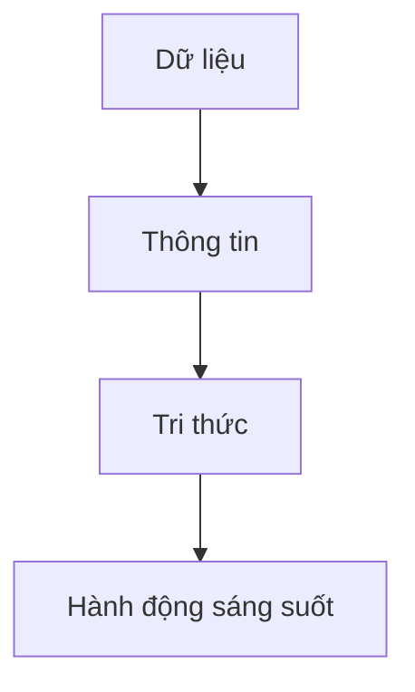

# Excel for Data Analysis
## 1. Tổng quan về phân tích dữ liệu
### 1.1. Dữ liệu, Thông tin và Tri thức

**Dữ liệu (Data) là các sự kiện thô (raw facts)**, chưa qua xử lí hay phân tích. Nó có thể là số liệu, hình ảnh, văn bản, âm thanh. 

**Thông tin (Information) là dữ liệu đã được xử lí**, phân tích, tổ chức và diễn giải sao cho nó mang lại ý nghĩa cho người dùng. Nói cách khác:

:::info
Thông tin = Dữ liệu + Ngữ cảnh + Ý nghĩa
:::

```
Ví dụ:
Dữ liệu: 4.9
Thông tin: GPA môn là 4.9, nhỏ hơn ngưỡng 5.0, tức là tạch môn
```

**Tri thức (knowledge) là cấp độ cao hơn của dữ liệu và thông tin** — nó là sự hiểu biết, kinh nghiệm, và khả năng áp dụng thông tin một cách có ý nghĩa để giải quyết vấn đề, đưa ra quyết định hoặc sáng tạo ra cái mới.



### 1.2. Phân tích dữ liệu là gì?

**Phân tích dữ liệu là quá trình kiểm tra, biến đổi và phân tích dữ liệu nhằm khám phá thông tin giá trị**, rút ra kết luận và hỗ trợ đưa ra quyết định chính xác dựa trên dữ liệu, thay vì cảm tính.

**Quy trình phân tích dữ liệu**


**Lợi ích**


### 1.3. Công việc trong ngành Phân tích Dữ liệu


Công việc thường yêu cầu 3 kĩ năng chính: **Am hiểu về lĩnh vực chuyên môn, kỹ thuật xử lý dữ liệu, và kỹ năng về khoa học dữ liệu**. Yêu cầu và phân bổ sẽ thay đổi dựa vào vị trí.

Cụ thể:


### 1.4. Các cấp độ của việc phân tích dữ liệu


### 1.5. Những lưu ý khi phân tích dữ liệu

**Phân biệt rõ ràng giữa Fact và Inference**

Phân tích dữ liệu đáng tin cậy phải dựa trên sự thật rõ ràng, chính xác từ nguồn đáng tin cậy. Cần phân biệt rõ giữa **dữ liệu thực tế (Fact)** và **diễn giải (Inference)** trong báo cáo.

```
Ví dụ
Fact: Giá cổ phiếu Công ty B đã tăng 30%.
Inference: Từ đó chứng tỏ Công ty B sắp được một quỹ đầu tư lớn rót vốn.
```

Ta có thể gây hiểu lầm và dẫn đến rủi ro khác nếu không phân biệt rõ giữa 2 khái niệm này.

**Bắt đầu bằng việc đặt câu hỏi**

Phân tích dữ liệu hiệu quả bắt đầu từ câu hỏi đúng, giả thuyết rõ ràng và kiểm chứng có phương pháp để ra quyết định chính xác.


Nếu không đặt câu hỏi, ta có thể mất thời gian để xem xét quá nhiều dữ liệu dư thừa, không cần thiết. 

**Phác thảo kết quả mong muốn trước khi phân tích**

Xác định rõ mục tiêu trước khi phân tích giúp tiết kiệm thời gian, nâng cao hiệu quả và định hướng đúng cho quá trình làm việc. Điều này đảm bảo thu thập đúng dữ liệu và áp dụng phương pháp phù hợp.


### 1.6. Về Excel

**Excel là công cụ cơ bản để phân tích dữ liệu**, tạo hình ảnh trực quan và là kỹ năng quan trọng cho nhiều công việc. Người ta hay dùng Excel cho phân tích dữ liệu cơ bản, trong khi đó các ngôn ngữ như **Python, R, SQL** dành cho những việc phức tạp hơn.

| **Dùng Excel khi**                                                                 | **Dùng ngôn ngữ lập trình khi**                                                        |
|----------------------------------------------------------------------------------------|---------------------------------------------------------------------------------------------|
| Dữ liệu nhỏ hoặc vừa (dưới 1 triệu dòng)                                             | Dữ liệu lớn (hàng triệu dòng trở lên)                                                     |
| Cần phân tích nhanh và tạo biểu đồ đơn giản                                          | Cần tạo mô hình phức tạp (machine learning, AI)                                          |
| Làm việc với người không chuyên môn về kỹ thuật                                      | Cần tự động hóa công việc thường xuyên                                                    |
| Làm các phép tính thống kê cơ bản                                                    | Cần kết nối với hệ thống và API khác                                                      |
| Cần tạo báo cáo nhanh và dễ chia sẻ                                                  | Phân tích phức tạp với nhiều nguồn dữ liệu                                                |
| Không cần tự động hóa phức tạp                                                       | Muốn tạo ứng dụng hoặc bảng thông tin tương tác                                           |

**Để sử dụng Excel hiệu quả**


## 2. Xu hướng dữ liệu qua thống kê cơ bản
### 2.1. Tại sao phải hiểu xu hướng dữ liệu?

Hiểu xu hướng dữ liệu không chỉ là nền tảng cho quyết định kinh doanh đúng đắn mà còn giúp doanh nghiệp dự đoán thay đổi, phát hiện bất thường và tối ưu hóa hiệu suất hoạt động.

Đây là một case study minh họa lí do.

| **Số liệu**             | **Cửa hàng A**                                                                 | **Cửa hàng B**                                                                 |
|-------------------------|----------------------------------------------------------------------------------|----------------------------------------------------------------------------------|
| **Doanh số**            | 48–52 triệu đồng/tháng (±4%)                                                    | 30–70 triệu đồng/tháng (±40%)                                                   |
| **Biến động theo tuần** | Độ lệch chuẩn: 1.2 triệu (nhỏ)                                                  | Tăng 60% cuối tuần, giảm 35% đầu tuần (mẫu hình rõ rệt)                         |
| **Khách hàng chính**    | 70% doanh số từ khách hàng thân thiết (≈35 triệu/tháng)                        | 60% doanh số từ khách hàng mới (≈30 triệu/tháng)                                |
| **Lợi nhuận biên**      | 22% (cao hơn trung bình ngành 3%)                                              | 18% (thấp hơn do chi phí marketing cao)                                         |
| **Chiến lược gợi ý**    | - Chăm sóc khách hàng hiện tại<br>- Loyalty program<br>- Tăng giá trị đơn hàng trung bình 15% | - Điều chỉnh nhân sự theo giờ cao điểm<br>- Tối ưu chiến dịch theo ngày<br>- Chuyển đổi khách hàng mới |

### 2.2. Các chỉ số thống kê cơ bản

Các chỉ số thống kê cơ bản cho ta nhiều góc nhìn khác nhau về dữ liệu.

**Trung bình (Mean)** Là nền tảng quan trọng của phân tích dữ liệu nhưng không nên chỉ dựa vào chỉ số này. Bởi nó không phải lúc nào cũng là điểm cân bằng, dữ liệu chưa chắc tập trung nhiều quanh Mean. Nhớ rằng Mean chưa chắc đại diện chính xác cho toàn bộ dữ liệu.

**Trung vị (Median)** Giúp bạn thấy rõ hơn về phân bố dữ liệu, đặc biệt khi dữ liệu bị lệch, có giá trị ngoại lai (outliers), hoặc phân phối không chuẩn (không đối xứng).

**Phương sai và độ lệch chuẩn** Cho biết mức độ phân tán của dữ liệu, giúp tránh những kết luận sai lầm. Trong đó độ lệch chuẩn là căn bậc hai của phương sai, có cùng đơn vị với dữ liệu gốc nên nó dễ hiểu hơn.

```
Case study:
Nhóm A: 100, 105, 95, 102, 98 triệu → Độ lệch chuẩn: 3.8
Nhóm B: 80, 120, 60, 140, 100 triệu → Độ lệch chuẩn: 31.6
Dù cùng trung bình 100 triệu, Nhóm B có độ rủi ro cao hơn vì biến động lớn hơn.
```

**Giá trị lớn nhất – nhỏ nhất** Đúng như tên gọi, nó giúp xác định phạm vi của dữ liệu.

### 2.3. Các hàm cơ bản trong Excel

Đây là một số hàm thống kê.


Đi kèm là một số hàm khác thông dụng.


Và một số phím tắt hữu ích.


**Data analysis tool**

Với Data Analysis Tool > Descriptive Statistics, ta nhận được đầy đủ các chỉ số như trung bình, mode, độ lệch chuẩn một cách nhanh chóng mà không cần nhập nhiều công thức.

**Pivot Table**

Pivot Table là công cụ mạnh mẽ giúp tổng hợp và phân tích lượng lớn dữ liệu một cách trực quan thông qua việc tái cấu trúc dữ liệu từ dạng bảng thành báo cáo có ý nghĩa. 

Pivot Table sắp xếp lại dữ liệu bằng cách gom nhóm và tính toán dựa trên các thành phần được đặt vào 4 khu vực chính:


:::info
Ưu điểm của Pivot Table là khả năng tự động tính toán lại khi bạn kéo thả các mục khác nhau vào các khu vực này, giúp xem dữ liệu từ nhiều góc độ khác nhau.
:::

## 3. Trực quan hóa dữ liệu
### 3.1. Tại sao cần trực quan hóa dữ liệu?

Trực quan hóa giúp nhận diện xu hướng nhanh, truyền đạt thông tin hiệu quả và hỗ trợ ra quyết định dựa trên bằng chứng trực quan.


Trực quan hóa dữ liệu giúp biến dữ liệu thô (số, bảng) thành hình ảnh dễ hiểu, từ đó phát hiện xu hướng, mẫu hình, bất thường, và giao tiếp thông tin hiệu quả hơn.


### 3.2. Các loại biểu đồ thông dụng


**Biểu đồ cột (Bar Plot)**

Có 4 loại biểu đồ cột được sử dụng thông dụng: vertical bar, horizontal bar,stacked vertical bar, stacked horizontal bar. Biểu đồ cột được sử dụng để so sánh giá trị giữa các danh mục, với chiều cao cột tương ứng với giá trị.


**Biểu đồ đường (Line Chart)**

Biểu đồ đường giúp xem sự thay đổi của dữ liệu theo thời gian một cách rõ ràng.


**Biểu đồ tròn (Pie Chart)**

Biểu đồ tròn thể hiện tỷ lệ các phần trong một tổng thể. Hiệu quả khi so sánh doanh thu, thị phần hoặc phân bổ ngân sách.


**Biểu đồ phân phối (Histogram)**

Biểu đồ histogram hiển thị phân phối tần suất của dữ liệu số bằng cách chia thành các khoảng và đếm số lượng điểm dữ liệu trong mỗi khoảng.


**Heatmap**

Heatmap là công cụ trực quan hóa dữ liệu bằng màu sắc, giúp nhận biết nhanh các mẫu và xu hướng thông qua thang màu đậm nhạt.


**Biểu đồ Water Flow**

Biểu đồ Water Flow (hay còn gọi là biểu đồ thác nước) là dạng biểu đồ trực quan hóa thể hiện sự thay đổi giá trị lũy kế theo từng giai đoạn, giúp người xem hiểu được các yếu tố đóng góp tích cực hoặc tiêu cực vào kết quả cuối cùng.


**Cách tạo biểu đồ Water FLow trong Excel**


**Scatter Plot**

Biểu đồ phân tán hiển thị mối quan hệ giữa hai biến số, giúp phát hiện mẫu và xu hướng trong dữ liệu.


### 3.3. Hệ số tương quan và ma trận tương quan

**Hệ số tương quan**

Hệ số tương quan đo lường mối quan hệ tuyến tính giữa hai biến, dao động từ -1 đến +1. Giá trị dương thể hiện quan hệ thuận, âm thể hiện quan hệ nghịch, và gần 0 cho thấy không có tương quan.


**Ma trận tương quan**

Ma trận tương quan phân tích mối quan hệ giữa nhiều biến cùng lúc, phát hiện đa cộng tuyến, và xác định các nhóm biến liên quan. Đây là công cụ thiết yếu trong phân tích dữ liệu đa biến.

| **Tạo ma trận tương quan**                                                                                                                                      | **Phân tích ma trận tương quan**                                                                                                                                |
|----------------------------------------------------------------------------------------------------------------------------------------------------------------|------------------------------------------------------------------------------------------------------------------------------------------------------------------|
| Ma trận tương quan phân tích mối quan hệ giữa nhiều biến đồng thời. Trong Excel, bạn có thể tạo ma trận này bằng công thức `CORREL` hoặc VBA để tự động hóa quá trình. |Ma trận tương quan giúp phát hiện đa cộng tuyến và xác định nhóm biến có liên quan chặt chẽ.                                                                  |
| Ma trận tương quan hoàn chỉnh là ma trận đối xứng, với giá trị 1 trên đường chéo chính.                                                                      | Việc phát hiện đa cộng tuyến rất quan trọng trong phân tích hồi quy, ảnh hưởng đến độ chính xác của mô hình. Nếu hai biến độc lập có tương quan cao (>0.7), nên cân nhắc loại bỏ một trong hai. |
